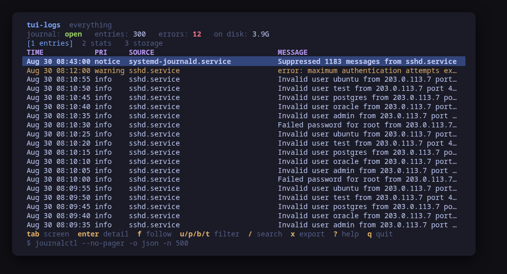
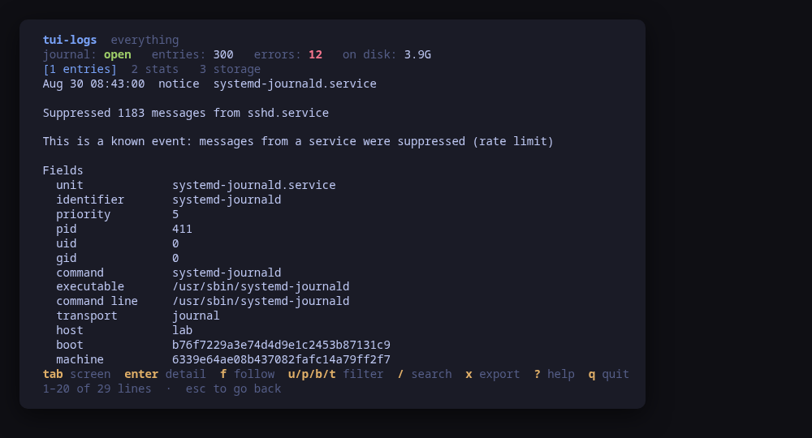
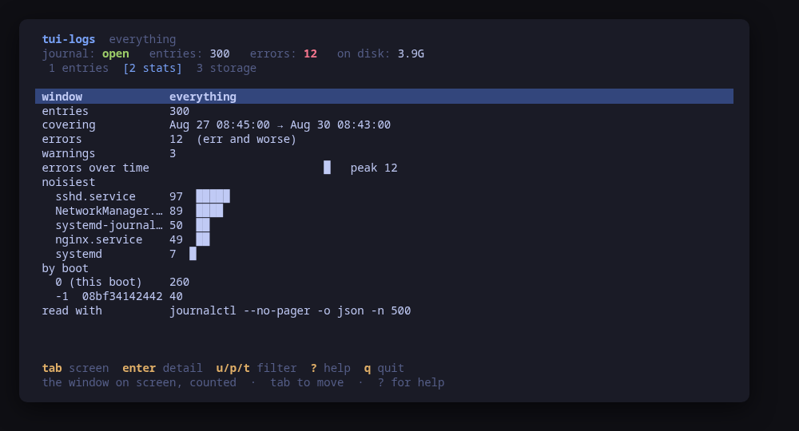
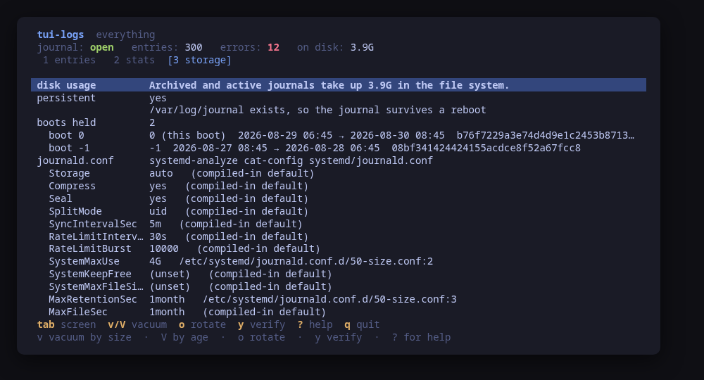
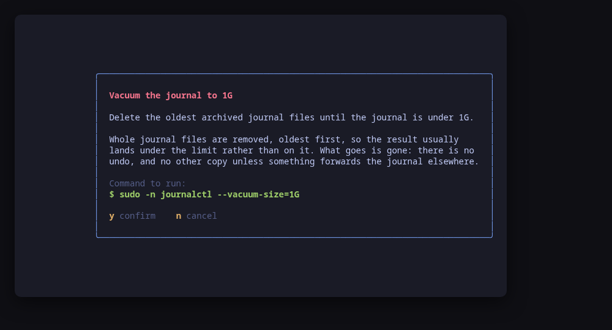
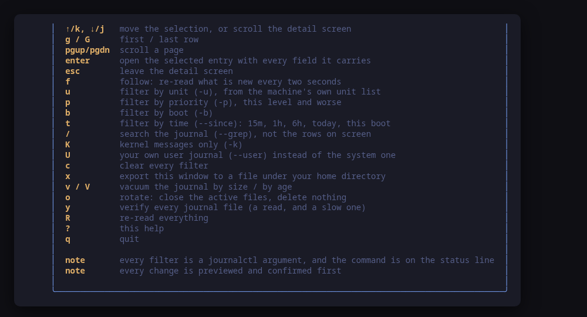

[](https://scorecard.dev/viewer/?uri=github.com/tui-tools/tui-logs)
[](https://www.bestpractices.dev/projects/14368)

> **Beta.** The family is days old and still changing. Package names, flags
> and keys may move without notice until 1.0. Pin versions, and report what
> breaks.

A terminal UI for the systemd journal. Every filter it offers is a `journalctl`
argument, **the command they add up to is on the status bar**, and every change
to the journal is previewed before it runs.

`journalctl` is not hard to use. It is hard to *hold*: `-u` and `-p` and `-b`
and `--since` and `--grep`, retyped in full every time you narrow the search by
one more thing, with the last version scrolled off the top. `tui-logs` makes
each of them a key, keeps the command visible, and never turns into something
you could not have typed.



> **Status: early, under validation.** An independent tool that follows the
> Omarchy visual style; it is **not** part of the Omarchy project and not
> endorsed by its maintainers. Expect rough edges.

## Install

<!-- install:start -->
<!-- Generated by tui-kit/tools/render-install.py from tool.json. -->
<!-- Edit the manifest, then run `make readme`. -->

### Arch Linux

Needs the tui-tools repository, which is a [one-time
setup](https://tui-tools.github.io/install/).

The one-liner detects the distribution and adds the repository and its signing
key:

```sh
curl -fsSL https://pkgs.tui.tools/install.sh | sh
```

Piping a script into a shell is not this family's style, so here is the same
setup by hand — read it, or read the script first with `curl -fsSL
https://pkgs.tui.tools/install.sh -o install.sh`:

```sh
curl -fsSL -o /tmp/tui-tools.asc https://pkgs.tui.tools/pubkey.asc
sudo pacman-key --add /tmp/tui-tools.asc
sudo pacman-key --lsign-key \
  "$(gpg --show-keys --with-colons /tmp/tui-tools.asc | awk -F: '/^fpr:/{print $10; exit}')"
printf '[tui-tools]\nServer = https://pkgs.tui.tools/arch/$arch\n' \
  | sudo tee -a /etc/pacman.conf
sudo pacman -Sy
```

Then, and for every other tool in the family:

```sh
sudo pacman -S tui-logs
```

Upgrades then arrive with the rest of your system updates.

### Debian and Ubuntu

Needs the tui-tools repository, which is a [one-time
setup](https://tui-tools.github.io/install/).

The one-liner detects the distribution and adds the repository and its signing
key:

```sh
curl -fsSL https://pkgs.tui.tools/install.sh | sh
```

Piping a script into a shell is not this family's style, so here is the same
setup by hand — read it, or read the script first with `curl -fsSL
https://pkgs.tui.tools/install.sh -o install.sh`:

```sh
sudo install -d -m 0755 /etc/apt/keyrings
curl -fsSL https://pkgs.tui.tools/pubkey.asc \
  | sudo gpg --dearmor -o /etc/apt/keyrings/tui-tools.gpg
echo "deb [signed-by=/etc/apt/keyrings/tui-tools.gpg] https://pkgs.tui.tools/deb stable main" \
  | sudo tee /etc/apt/sources.list.d/tui-tools.list
sudo apt update
```

Then, and for every other tool in the family:

```sh
sudo apt install tui-logs
```

Upgrades then arrive with the rest of your system updates.

### Fedora and RHEL

Needs the tui-tools repository, which is a [one-time
setup](https://tui-tools.github.io/install/).

The one-liner detects the distribution and adds the repository and its signing
key:

```sh
curl -fsSL https://pkgs.tui.tools/install.sh | sh
```

Piping a script into a shell is not this family's style, so here is the same
setup by hand — read it, or read the script first with `curl -fsSL
https://pkgs.tui.tools/install.sh -o install.sh`:

```sh
sudo rpm --import https://pkgs.tui.tools/pubkey.asc
sudo curl -fsSL -o /etc/yum.repos.d/tui-tools.repo https://pkgs.tui.tools/rpm/tui-tools.repo
sudo dnf makecache
```

Then, and for every other tool in the family:

```sh
sudo dnf install tui-logs
```

Upgrades then arrive with the rest of your system updates.

### Any distribution, static binary

```sh
curl -fsSL https://github.com/tui-tools/tui-logs/releases/download/v0.1.2/tui-logs_0.1.2_linux_amd64.tar.gz | tar -xz tui-logs
sudo install -m0755 tui-logs /usr/local/bin/tui-logs
```

One static binary. Verify it against checksums.txt from the same release.

### From source

```sh
git clone https://github.com/tui-tools/tui-logs
cd tui-logs && make build
sudo install -m0755 bin/tui-logs /usr/local/bin/tui-logs
```

Needs Go 1.27 or newer.

Not packaged for these yet; the static binary works everywhere in the meantime.

### Arch Linux (AUR) — coming soon

```sh
paru -S tui-logs-bin
```

The -bin package installs the released static binary.

### openSUSE — coming soon

Needs the tui-tools repository, which is a [one-time
setup](https://tui-tools.github.io/install/).

```sh
sudo zypper install tui-logs
```

The rpm repository is shared with dnf; zypper support is not tested yet.

### Verify a download

Every release of `tui-logs` ships a `checksums.txt`. Check an archive against
it before installing:

```sh
sha256sum -c checksums.txt --ignore-missing
```
<!-- install:end -->

One static binary, no daemon, no state of its own. Nothing keeps running after
you quit.

## Try it without a journal to break

```sh
tui-logs --demo
```

`--demo` runs against a sample journal: three hundred entries across five units
and the kernel, two boots, a database that keeps failing to start, and one
address working through a user list against `sshd`. Every key works, every
command is built and previewed for real, and nothing touches your system.

## The filters are the command

There is no query language here. Each key sets one `journalctl` argument, and
the status bar shows the whole invocation:

| Key | Argument |
| --- | --- |
| `u` | `-u <unit>`, from `journalctl --field _SYSTEMD_UNIT` — the units that have written to the journal, or a name you type |
| `p` | `-p <level>`, which journalctl reads as "this level and worse" |
| `b` | `-b <boot>`, from `journalctl --list-boots` |
| `t` | `--since`, as one of `15m`, `1h`, `6h`, `today`, `this boot` |
| `/` | `--grep <pattern>` |
| `K` | `-k`, the kernel ring buffer |
| `U` | `--user`, your own journal instead of the system one |
| `c` | clears all of it |

`/` is worth a paragraph. It is `--grep`, which searches the journal on the
machine, **not** the rows already read. A client-side filter would search the
last five hundred entries, and the line somebody is looking for is almost never
in the last five hundred. Lower case matches either case; a capital anywhere
makes it exact — that is journalctl's rule, not one invented here.

The unit picker lists the units the **journal** has entries for, which on this
machine is 249 names where `systemctl list-units --all` has 662. The difference
is mounts, devices, slices and targets that have never logged a line: picking
one filters the journal down to nothing, and having them in the list is what
made finding `sshd.service` a matter of holding an arrow key down. The count
and which list it is are in the picker's title.

Its first entry types a name instead, and that reaches **any** unit — one whose
entries have already been rotated away, one this machine has and has not used,
one that does not exist yet. So the picker being short costs nothing.

What the picker deliberately does not list is "the units that appear in this
window": the unit you are looking for is usually the one that *stopped*
logging, and it is in the journal's list either way.

### Following

`f` follows. It is not `journalctl -f`: it re-reads with `--after-cursor` every
two seconds, asking only for the entries the screen has not seen. `-f` never
exits, and a command that never exits cannot be the same value the preview
showed and the runner ran — which is the promise the whole family is built on.
The cost is a short invocation every couple of seconds; the benefit is that
there is nothing running behind the screen.

## One entry, in full



`enter` opens the record rather than the sentence: the pid, the uid, the
executable and its command line, the transport, the boot, the source file and
line for a program that logs through `sd-journal`, and every other field the
journal happened to carry. The journal has no schema, so nothing is dropped for
not being recognised — the fields the screens are built on come first, and the
rest follow under the names the journal gave them.

A `MESSAGE_ID` is shown with a name when it is one of the well-known events —
"a unit failed to start", "a process was killed by the OOM killer" — from
systemd's own catalogue. An id this tool does not know is shown as itself;
nothing is invented for it.

There is no clipboard in a terminal to copy any of this with. What the screen
offers instead is the command that prints exactly this entry again:

```console
$ journalctl --no-pager -o verbose -n 1 --cursor 's=…;i=…;b=…;m=…;t=…'
```

which works in any shell, on any machine holding the same journal.

## What the window is made of



`2` counts what is on screen: errors and warnings, the noisiest units, how the
entries fall across boots, and a sparkline of the errors over the period.

Everything there is counted from the entries that were **actually read**, and
the screen says so: a read is bounded by a line count, so on a machine logging
heavily five hundred entries can be four minutes, and "the noisiest unit" over
four minutes is a different claim from the same words over a day. When the read
hit its limit the screen says that too, on the row above the counts.

`--check` reports "errors in the last hour" as a separate, narrower read for
exactly this reason — an hour has to mean the hour.

## What the journal costs



`3` is the journal as a thing on a disk: what `journalctl --disk-usage` says,
the boots it still holds, and whether it survives a reboot.

That last one is a directory, not a setting. `journald` writes to
`/var/log/journal` when it exists and to `/run/log/journal` when it does not,
whatever `Storage=` says, because `auto` is the default and `auto` means
exactly that. The screen reports which — and where it used to hand you a shell
command for it, `S` now offers `Storage=persistent`, which is what makes
journald create that directory itself on its next start.

Below that is `journald.conf` as it actually resolves, from
`systemd-analyze cat-config systemd/journald.conf`, with the file and line
behind each setting and the compiled-in defaults marked as such. journald's
rule is the opposite of `sshd`'s: the **last** value read wins, so a drop-in
beats the vendor file, and that is what the screen shows.

## Retention: how much journal, and for how long

The screen above answers "what does the journal cost". `S` is the one key that
changes the answer, rather than shrinking the journal once and letting it grow
straight back:

| Key | What it sets | Values |
| --- | --- | --- |
| `S` | `SystemMaxUse` | how much disk the journal may take: `500M`, `2G`, `4G` |
| | `MaxRetentionSec` | how old an entry may get: `30d`, `6months`, `1year` |
| | `Storage` | `auto`, `persistent` or `volatile` |

Each prompt opens on what the machine says today — this tool's own drop-in
when there is one, and `systemd-analyze cat-config` otherwise — so a first run
starts from the real numbers rather than from three blanks. An empty answer
leaves that key out of the file, which is how a limit is removed rather than
only changed.

What gets written is one file and always the same one:
`/etc/systemd/journald.conf.d/50-tui-logs.conf`. It belongs to tui-logs, holds
nothing else, and says in its own header that deleting it undoes everything.
Nothing anyone else wrote is touched — journald reads a vendor file plus a
directory of drop-ins, which is exactly what makes a tool-owned file possible.

The confirm dialog shows a **unified diff** against what is on disk, not the
new file and not a sentence about it, and then the two commands:

```console
$ sudo -n install -D -m 644 /tmp/tui-logs-.../50-tui-logs.conf /etc/systemd/journald.conf.d/50-tui-logs.conf
$ sudo -n systemctl restart systemd-journald
```

The file is staged before you are asked anything, so the diff is of a file
that already exists and `install` copies exactly that one.

**Why a restart and not a reload.** journald re-reads its configuration on
`SIGHUP`, and `systemctl reload` sends one — but the size and age limits are
enforced from the moment the journal files are opened, so a reloaded journald
goes on applying the limits it started with until something else rotates them.
The restart is what makes the new numbers true now. It loses no entries: what
arrives during it waits in the kernel's buffer.

If this machine has no privilege escalation this tool can use, the drop-in
cannot be installed and journald cannot be restarted, so `S` says so on the
storage screen instead of failing at the dialog.

## Housekeeping



Four commands, each previewed and confirmed:

| Key | What runs | What it does |
| --- | --- | --- |
| `v` | `journalctl --vacuum-size=<N>` | Removes whole archived journal files, oldest first, until the total is under the limit. **There is no undo.** |
| `V` | `journalctl --vacuum-time=<T>` | The same, by age. |
| `o` | `journalctl --rotate` | Closes the active files and starts new ones. Deletes nothing. |
| `y` | `journalctl --verify` | Checks every file's hashes. A read, and on a large journal a slow one. |

`systemctl restart systemd-journald` is not one of these four. It appears in
exactly one place — the second half of the retention plan above — because
that is the only thing it is genuinely needed for. As a standalone button next
to `--rotate` it would be the obvious fifth one and the wrong one: `--rotate`
does the useful half of it, and a restart nobody has a reason for is a restart
nobody should be offered.

## Export

`x` writes the window on screen to a file under your home directory, as
`journalctl -o short-iso` prints it.

There is no shell anywhere in that path, so there is no `>` either. The read
runs first, the result is staged in a private temporary file, and the command
you confirm is the one that copies it:

```console
$ install -m 600 /tmp/tui-logs-1a2b/journal-20260830-114500.log /home/you/journal-20260830-114500.log
```

Mode 600, because a journal export can carry anything the machine logged. The
destination must be inside your home directory — not because the kernel would
allow otherwise, but because a log viewer that can write to `/etc` is a
different tool.

## Who is allowed to read the journal

Reading the **system** journal is a group question, not a root one: membership
of `systemd-journal`, `adm` or `wheel` is enough, and on most distributions an
administrator already has it. `tui-logs` reads unprivileged first, so it opens
instantly and without a password.

Only a machine that refuses gets an escalated retry through `sudo -n`, which
never prompts. journalctl is unusual here — it reports the refusal on standard
error and still exits **zero**, having shown you your own entries — so the
refusal is detected in the output rather than in the exit code.

The header says which of the three you are looking at:

| | |
| --- | --- |
| `journal: open` | read as you, with the access you already had |
| `journal: via sudo -n` | the plain read was refused and the escalated one worked |
| `journal: your entries only` | both were refused; what is on screen is yours, not the machine's |

The third one is spelled out rather than left as an empty screen. A log viewer
that showed nothing and let you conclude the machine was quiet would be worse
than useless.

## Usage

```sh
tui-logs                       # the machine's journal
tui-logs --demo                # sample journal, no privileges needed
tui-logs --check               # read it, print JSON, exit
tui-logs --report              # print what a bug report needs, exit
tui-logs --lines 2000          # a wider window
tui-logs --theme ~/mytheme/colors.toml
tui-logs --sudo ""             # run the commands directly (as root)
tui-logs --version
```

### `--check`, for scripts and tests

`--check` is the non-interactive read path: it loads the journal through the
same backend the UI would use, prints what it parsed as JSON and exits 0, or
exits 1 with the reason if the backend cannot be read. No UI, and it never
builds or runs a mutation, so it is safe to run anywhere.

```console
$ tui-logs --check | head -16
{
  "tool": "tui-logs",
  "version": "0.1.0",
  "backend": "journald",
  "describe": "journalctl",
  "escalated": false,
  "denied": false,
  "command": "journalctl --no-pager -o json -n 500",
  "entries": 500,
  "errors": 9,
  "warnings": 316,
  "truncated": true,
  "errorsLastHour": 355,
  "topUnits": [
    {
      "name": "kernel",
```

It exists so a test can assert on what the tool *parsed* rather than on what it
painted — that the boot count matches `journalctl --list-boots`, that the disk
usage matches `journalctl --disk-usage`, that the errors in the last hour match
`journalctl -p err --since -1h`, and, on a machine where the journal cannot be
opened, that the tool said so instead of showing an empty screen.

[tui-lab](https://github.com/tui-tools/tui-lab) uses it to test this tool
against real machines on Ubuntu, Fedora and Arch; the assertions live in
[`test/smoke.sh`](test/smoke.sh), and every one of them is read-only.

### `--report`, for bug reports

`--report` prints, in one block, everything a maintainer has to ask for
otherwise: the tool and kit versions, the systemd the version probe read, which
of the two boot-list parsers that version selects, how wide a window one read
pulls back, the distribution, the kernel, the terminal, the theme, the
escalation prefix, and whether the running binary came from a package. It needs
no privileges and reads no journal, so it works on the machine where the bug is
— including one with no journalctl at all, which is itself a thing worth
reporting.

```console
$ tui-logs --report
tui-logs 0.1.0 (kit v0.2.9)
backend: journald 257
mode: live
distro: fedora 42 (Fedora Linux 42 (Workstation Edition))
kernel: 6.19.14-108.fc42.x86_64
arch: x86_64
locale: en_US.UTF-8
term: xterm-256color
theme: tokyo-night
sudo: sudo -n
root: no
binary: /usr/bin/tui-logs (packaged)
boot list: json
lines: 500
```

The block is written to be published as it is: it carries no hostname, user
name, home path or address, and no environment variable beyond `LANG`,
`LC_ALL`, `TERM` and `TERM_PROGRAM`. A binary living under your home directory
is reported as being there without naming the path. Nothing about the journal
itself is in it — not an entry, not a unit name, not a count. `--report` works
with `--demo` too, where it says so on the `mode` line.

The bug form asks for this block first — see
[`.github/ISSUE_TEMPLATE/bug_report.yml`](.github/ISSUE_TEMPLATE/bug_report.yml).

## What it can do to your machine

Every one of these is previewed and confirmed first.

| Key | What runs |
| --- | --- |
| `v` | `journalctl --vacuum-size=<size>`, from a closed list of sizes |
| `V` | `journalctl --vacuum-time=<age>`, from a closed list of ages |
| `o` | `journalctl --rotate` |
| `y` | `journalctl --verify` (a read) |
| `x` | `install -m 600 <staged file> <path under $HOME>` |
| `S` | `install -D -m 644 <staged file> /etc/systemd/journald.conf.d/50-tui-logs.conf`, then `systemctl restart systemd-journald` |

Nothing else. There is no code path that writes anything else anywhere: the
export's `install` refuses a destination outside your home directory, the
retention one has its destination compiled in and can write no other path, and
the vacuum arguments come from a fixed list rather than a text field, because a
typo in that field is a machine vacuumed down to nothing. The three keys the
retention form collects are a closed set too, and every value is checked
against what journald accepts before it becomes a line in a file.

## Keys

| Key | Action |
| --- | --- |
| `tab` / `1`–`3` | Move between entries, stats and storage |
| `↑`/`k`, `↓`/`j` | Move the selection, or scroll the detail screen |
| `g` / `G` | First / last row |
| `pgup` / `pgdn` | Scroll a page |
| `enter` | Open the selected entry with every field it carries |
| `esc` | Leave the detail screen |
| `f` | Follow: re-read what is new every two seconds |
| `u` / `p` / `b` / `t` | Filter by unit, priority, boot, time window |
| `/` | Search the journal (`--grep`) |
| `K` / `U` | Kernel only / your own user journal |
| `c` | Clear every filter |
| `x` | Export the window to a file |
| `S` | Set the retention limits: how much journal, and for how long |
| `v` / `V` | Vacuum by size / by age |
| `o` | Rotate |
| `y` | Verify |
| `R` | Re-read everything |
| `?` | Help |
| `q` | Quit |



## What v0.1 can do

- Read a window of the journal as JSON and show it as a table: time, priority,
  unit or syslog identifier, message — coloured by how bad the entry is.
- Narrow it by unit, priority, boot, time window, pattern, the kernel or the
  user journal, with every filter an argument and the whole command on screen.
- Follow, by re-reading with `--after-cursor` rather than by holding a process
  open.
- Show one entry with every field the journal carried, a name for a
  well-known `MESSAGE_ID`, and the `journalctl --cursor` command that prints it
  again.
- Count the window: errors, warnings, the noisiest units, entries per boot, and
  a sparkline of the errors over it — saying plainly when the window is the
  read limit rather than the whole period.
- Report what the journal costs on disk, the boots it holds, whether it
  survives a reboot, and `journald.conf` as it resolves with the file behind
  each setting.
- Vacuum by size or by age, rotate and verify, each previewed and confirmed.
- Export the window to a file under `$HOME`, staged and previewed first.
- Say which of three ways the journal was opened, and what to do about the
  third.
- Follow the active Omarchy theme, and respect `NO_COLOR`.

## What v0.1 cannot do

- **It does not edit `journald.conf`.** The settings in force are shown, with
  the file and line behind each; changing one is a job for `$EDITOR` and
  `systemctl restart systemd-journald`, and the screen names both.
- **It does not make a journal persistent.** It tells you it is not, and the
  two commands that change that.
- **No `systemctl restart systemd-journald`**, for the reason above.
- **No unit management.** What a unit is, why it failed and how to restart it
  is [tui-systemd](https://github.com/tui-tools/tui-systemd)'s question; this
  tool only reads a unit list to fill a picker.
- **No remote journals**: no `-m`/`--merge` across machines, no
  `systemd-journal-remote`, no `--file`. One machine's journal, as it is.
- **No `--cursor-file`.** Follow keeps the cursor in memory and passes
  `--after-cursor`; a file on disk would add state to a tool whose whole point
  is not having any.
- **No `-x`** (the catalogue text for an entry). The short name is carried in
  the binary for the common ids; the full explanation is one `journalctl -x`
  away, and the detail screen gives you the command.

## Compatibility

<!-- compat:start -->
<!-- Generated by tui-kit/tools/render-compat.py from tool.json. -->
<!-- Edit the manifest, then run `make readme`. -->

`tui-logs` probes its backend once at startup and shows the version in the
header. A version nobody has tested is marked `(untested)` there rather than
hidden; one below the minimum is marked as such and the tool still runs.

### journald

| | |
| --- | --- |
| Binary | `journalctl` |
| Version read with | `journalctl --version` |
| Minimum | 239 |
| Tested | `255`, `259`, `261` |
| Version-gated features | `list-boots-json` (since 252) |

| Versions | What changes |
| --- | --- |
| `>=239` | the version comes from `journalctl --version`, whose first line is `systemd 257 (257.13-1.fc42)`; the first number is the release and the package version after it is ignored |
| `>=239` | only one thing here is version-gated. `--grep` (237), `--after-cursor` (206) and `systemd-analyze cat-config` (239) all exist at or below the minimum, so they are never checked for |
| `<252` | `journalctl --list-boots` cannot print JSON, so the boot list is parsed from its table instead; the picker works either way and nothing else changes |

The tested versions are generated from `compat/results.jsonl`, which the tool's
own smoke test appends to when it runs against a real machine in
[tui-lab](https://github.com/tui-tools/tui-lab).
<!-- compat:end -->

## Configuration

`/etc/tui-logs/config.toml`, then `~/.config/tui-logs/config.toml` (the user
file overrides the machine-wide one), then `TUI_LOGS_*` in the environment.
Flags override everything. See [`examples/config.toml`](examples/config.toml).

```toml
# Privilege escalation prefix; "" runs the command directly.
sudo = "sudo -n"

# Path to an Omarchy-style colors.toml; empty follows the active theme.
theme = ""

# How many entries one read pulls back (journalctl -n).
lines = 500
```

## Theme

The default palette is **Tokyo Night**. On Omarchy, the tool reads the active
desktop theme from `~/.config/omarchy/current/theme/colors.toml` and follows it.
`TUI_THEME` or `--theme` override; `NO_COLOR` drops color and keeps layout. The
rules live in [tui-kit](https://github.com/tui-tools/tui-kit#theme-rules).

## Architecture

The UI never builds a `journalctl`, `systemctl` or `systemd-analyze` command
line. It talks to `internal/logs.Backend`, which returns a store-neutral model:

```
Model{Filter, Command, Entries, Units, Boots, Storage, Stats, Access}
Entry{Cursor, Realtime, Priority, Unit, Identifier, Message, …, Fields}
Filter{Unit, Priority, Boot, Since, Until, Grep, Kernel, User, Lines}
```

`internal/journald` is the only package that starts a process. It drives four
programs through five kit runners — `journalctl` twice, unprivileged and
through the privilege prefix, plus `systemctl`, `systemd-analyze` and
`install` — and
[`check-exec.sh`](https://github.com/tui-tools/tui-kit/blob/main/tools/check-exec.sh)
fails the build if any other package imports `os/exec`.

Every read and every action is a `runner.Command`: an argv and a description.
The one that builds a filter's argv, `BuildRead`, is the same one the status
bar renders, so the command on screen is not a description of the read — it
*is* the read. On confirmation the UI hands the same value back to the
[kit runner](https://github.com/tui-tools/tui-kit#the-contract-preview-confirm-run),
which resolves the binary and the privilege prefix. That is the whole trust
boundary, and it is why the preview is guaranteed to match what executes.

## Development

```sh
make check        # gofmt, go vet, the exec boundary and the tests: what CI runs
make test
make build
make demo
make screenshots  # re-render the frames above from --demo
```

The parser tests run against captured output in `internal/journald/testdata`.
All of it is real — `journalctl -o json`, `--list-boots` in both formats,
`--disk-usage`, `--field _SYSTEMD_UNIT`, `systemctl list-units` and
`systemd-analyze cat-config` all answer to any user — from a Fedora 42 host,
with the hostname and machine id rewritten. One file is synthetic and says so: `journal-json-shapes.txt` carries
a message that is not valid UTF-8 and a field that repeated, because a real
journal cannot be relied on to contain either and the parser has to survive
both. `journal-units.txt` is a real capture cut down to forty names, keeping
one of every shape the parser has to read: a scope, a template instance, and a
device name with `\x` escapes in it.

Dependencies are deliberately small: Bubble Tea, Bubbles and
[tui-kit](https://github.com/tui-tools/tui-kit), which carries the palette, the
widgets, the config loader and the command runner shared by the whole family.

## Safety notes

- **Vacuuming is the only thing here that destroys anything, and it destroys
  whole files.** `--vacuum-size=1G` removes archived journal files, oldest
  first, until the total is under a gigabyte; the result usually lands well
  under it. There is no undo and no second copy unless something forwards the
  journal elsewhere.
- `--rotate` is the safe half of that answer: nothing is deleted, the active
  files become archived ones, and a vacuum then has something to work with.
- Reading needs no escalation on a machine where your account is in
  `systemd-journal`, `adm` or `wheel`. Only the four housekeeping commands
  always escalate, through `sudo -n`, which never prompts.
- An export is written as you, not as root, into your own home directory, mode
  600 — and the read that fills it happens before you are asked, so the dialog
  can tell you how many lines and how many bytes are about to be written.
- `tui-logs` re-reads after every change, so what you see is what the system
  reports, not what the tool assumed.

## Contributing

Contributions are welcome as pull requests; the workflow, the commit style and
the checks a change has to pass are described in the family's
[CONTRIBUTING.md](https://github.com/tui-tools/tui-kit/blob/main/CONTRIBUTING.md).
Security vulnerabilities go through the family's
[SECURITY.md](https://github.com/tui-tools/tui-kit/blob/main/SECURITY.md)
instead, never in a public issue.

## License

MIT — see [LICENSE](LICENSE). Part of the
[tui-tools](https://github.com/tui-tools) family.
